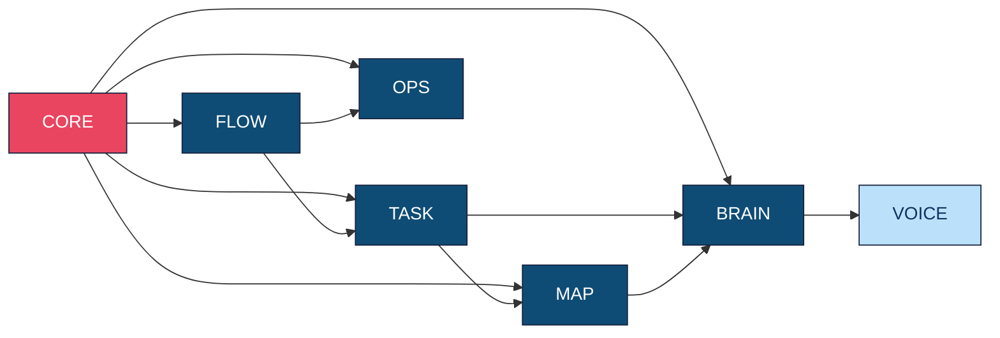

# Brand/Module Tree (Marka Ağacı)

Agent Palace platformunun marka hiyerarşisi ve modül yapısı.

## Brand Hierarchy

```mermaid
graph TD    EA[everything agent<br/>🏢 Ana Şirket]
    
    EA --> PALACE[Agent Palace<br/>🏰 Ana Platform]
    
    PALACE --> CORE[AgentsCore<br/>⚙️ Temel Altyapı]
    PALACE --> FLOW[AgentsFlow<br/>🔄 İş Akışı Motoru]
    PALACE --> TASK[AgentsTask<br/>📋 Görev Yönetimi]
    PALACE --> OPS[AgentsOps<br/>🔧 Operasyon & İzleme]
    PALACE --> MAP[AgentsMap<br/>🗺️ Kaynak Haritası]
    PALACE --> BRAIN[AgentsBrain<br/>🧠 AI Karar Motoru]
    PALACE --> VOICE[AgentsVoice<br/>🎤 Ses Entegrasyonu]
    
    %% Core submodules
    CORE --> CORE_AUTH[Authentication]
    CORE --> CORE_API[API Framework]
    CORE --> CORE_DB[Database Layer]
    CORE --> CORE_CACHE[Caching Layer]
    
    %% Flow submodules
    FLOW --> FLOW_ENGINE[Workflow Engine]
    FLOW --> FLOW_BUILDER[Visual Builder]
    FLOW --> FLOW_EXEC[Execution Runtime]
    FLOW --> FLOW_MONITOR[Flow Monitoring]
    
    %% Task submodules
    TASK --> TASK_QUEUE[Task Queue]
    TASK --> TASK_SCHEDULE[Scheduler]
    TASK --> TASK_ASSIGN[Assignment Logic]
    TASK --> TASK_TRACK[Progress Tracking]
    
    %% Ops submodules
    OPS --> OPS_HEALTH[Health Checks]
    OPS --> OPS_METRICS[Metrics Collection]
    OPS --> OPS_ALERTS[Alert Management]
    OPS --> OPS_LOGS[Log Aggregation]
    
    %% Map submodules
    MAP --> MAP_RESOURCE[Resource Discovery]
    MAP --> MAP_CAPABILITY[Capability Mapping]
    MAP --> MAP_TOPOLOGY[Network Topology]
    MAP --> MAP_INVENTORY[Asset Inventory]
    
    %% Brain submodules
    BRAIN --> BRAIN_ML[Machine Learning]
    BRAIN --> BRAIN_NLP[Natural Language Processing]
    BRAIN --> BRAIN_DECISION[Decision Engine]
    BRAIN --> BRAIN_LEARN[Learning Algorithms]
    
    %% Voice submodules (opsiyonel)
    VOICE --> VOICE_STT[Speech to Text]
    VOICE --> VOICE_TTS[Text to Speech]
    VOICE --> VOICE_NLU[Natural Language Understanding]
    VOICE --> VOICE_DIALOG[Dialog Management]
    
    classDef company fill:#1a1a2e,stroke:#16213e,color:#fff
    classDef platform fill:#0f3460,stroke:#16213e,color:#fff
    classDef core fill:#e94560,stroke:#16213e,color:#fff
    classDef module fill:#0f4c75,stroke:#16213e,color:#fff
    classDef submodule fill:#3282b8,stroke:#16213e,color:#fff
    classDef optional fill:#bbe1fa,stroke:#16213e,color:#0f3460
    
    class EA company
    class PALACE platform
    class CORE core
    class FLOW,TASK,OPS,MAP,BRAIN module
    class VOICE optional
    class CORE_AUTH,CORE_API,CORE_DB,CORE_CACHE,FLOW_ENGINE,FLOW_BUILDER,FLOW_EXEC,FLOW_MONITOR,TASK_QUEUE,TASK_SCHEDULE,TASK_ASSIGN,TASK_TRACK,OPS_HEALTH,OPS_METRICS,OPS_ALERTS,OPS_LOGS,MAP_RESOURCE,MAP_CAPABILITY,MAP_TOPOLOGY,MAP_INVENTORY,BRAIN_ML,BRAIN_NLP,BRAIN_DECISION,BRAIN_LEARN,VOICE_STT,VOICE_TTS,VOICE_NLU,VOICE_DIALOG submodule
```

## Module Descriptions

### 🏰 AgentsPalace (Ana Platform)
Ana platform, tüm agent modüllerini bir araya getiren merkezi hub.

### ⚙️ AgentsCore (Temel Altyapı)
Tüm modüller tarafından paylaşılan temel altyapı bileşenleri:
- **Authentication**: JWT tabanlı kimlik doğrulama
- **API Framework**: RESTful API altyapısı
- **Database Layer**: PostgreSQL abstraction layer
- **Caching Layer**: Redis entegrasyonu

### 🔄 AgentsFlow (İş Akışı Motoru)
Karmaşık iş akışlarını tanımlama ve yürütme:
- **Workflow Engine**: YAML/JSON tabanlı akış tanımlama
- **Visual Builder**: Drag-drop akış editörü
- **Execution Runtime**: Paralel/sıralı akış yürütme
- **Flow Monitoring**: Gerçek zamanlı akış izleme

### 📋 AgentsTask (Görev Yönetimi)
Agent görevlerini planlama ve yönetme:
- **Task Queue**: Kuyruk tabanlı görev dağıtımı
- **Scheduler**: Zaman tabanlı görev planlaması
- **Assignment Logic**: Optimal agent seçimi
- **Progress Tracking**: Görev durumu takibi

### 🔧 AgentsOps (Operasyon & İzleme)
Sistem sağlığı ve performans izleme:
- **Health Checks**: Sistem durumu kontrolü
- **Metrics Collection**: Performans metrikleri
- **Alert Management**: Akıllı alarm sistemi
- **Log Aggregation**: Merkezi log toplama

### 🗺️ AgentsMap (Kaynak Haritası)
Sistem kaynaklarını haritalama ve optimizasyon:
- **Resource Discovery**: Otomatik kaynak keşfi
- **Capability Mapping**: Agent yetenek haritalama
- **Network Topology**: Ağ topolojisi analizi
- **Asset Inventory**: Varlık envanteri yönetimi

### 🧠 AgentsBrain (AI Karar Motoru)
Yapay zeka destekli karar verme sistemi:
- **Machine Learning**: Öğrenme algoritmaları
- **Natural Language Processing**: Dil işleme
- **Decision Engine**: Akıllı karar verme
- **Learning Algorithms**: Adaptif öğrenme

### 🎤 AgentsVoice (Ses Entegrasyonu - Opsiyonel)
Sesli etkileşim yetenekleri:
- **Speech to Text**: Ses tanıma
- **Text to Speech**: Ses sentezi
- **Natural Language Understanding**: Dil anlama
- **Dialog Management**: Konuşma yönetimi

## Module Dependencies



## Development Phases

### Phase 1: Foundation (Current)
- ✅ AgentsPalace Landing Page
- ✅ AgentsCore (Authentication, API basics)
- 🔄 Documentation & SDLC setup

### Phase 2: Core Services
- 🔄 AgentsFlow (Workflow engine)
- 🔄 AgentsTask (Task management)
- 🔄 AgentsOps (Basic monitoring)

### Phase 3: Intelligence
- ⏳ AgentsMap (Resource mapping)
- ⏳ AgentsBrain (AI decision making)

### Phase 4: Advanced Features
- ⏳ AgentsVoice (Voice integration)
- ⏳ Advanced analytics and reporting

## Naming Conventions

- **everything agent**: Ana şirket markası
- **AgentsPalace**: Platform markası (büyük A, büyük P)
- **Agents[Module]**: Modül markası (örn: AgentsFlow, AgentsTask)
- **snake_case**: Database tablo ve alan isimleri
- **camelCase**: JavaScript/TypeScript değişken isimleri
- **PascalCase**: React component isimleri
- **kebab-case**: URL ve dosya isimleri

---

**Son Güncelleme:** 2025-01-22  
**Versiyonu:** v1.0  
**Sorumlu:** AgentsPalace Architecture Team
