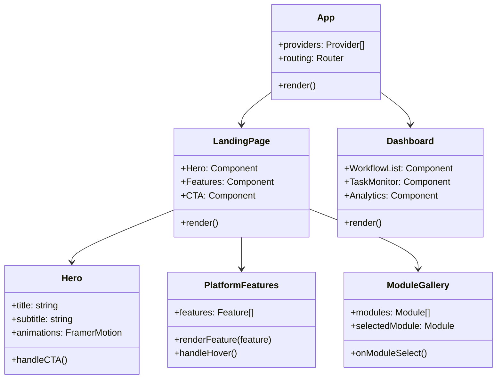
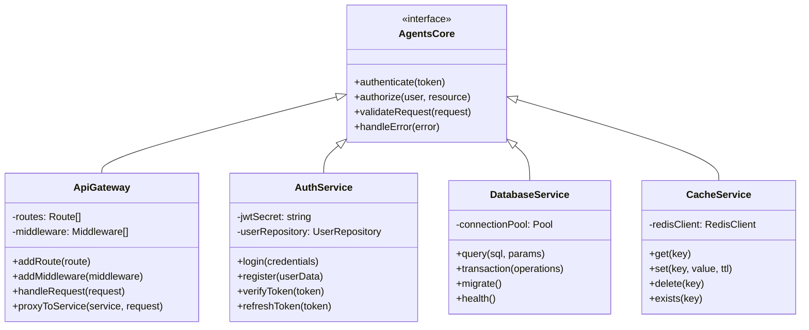
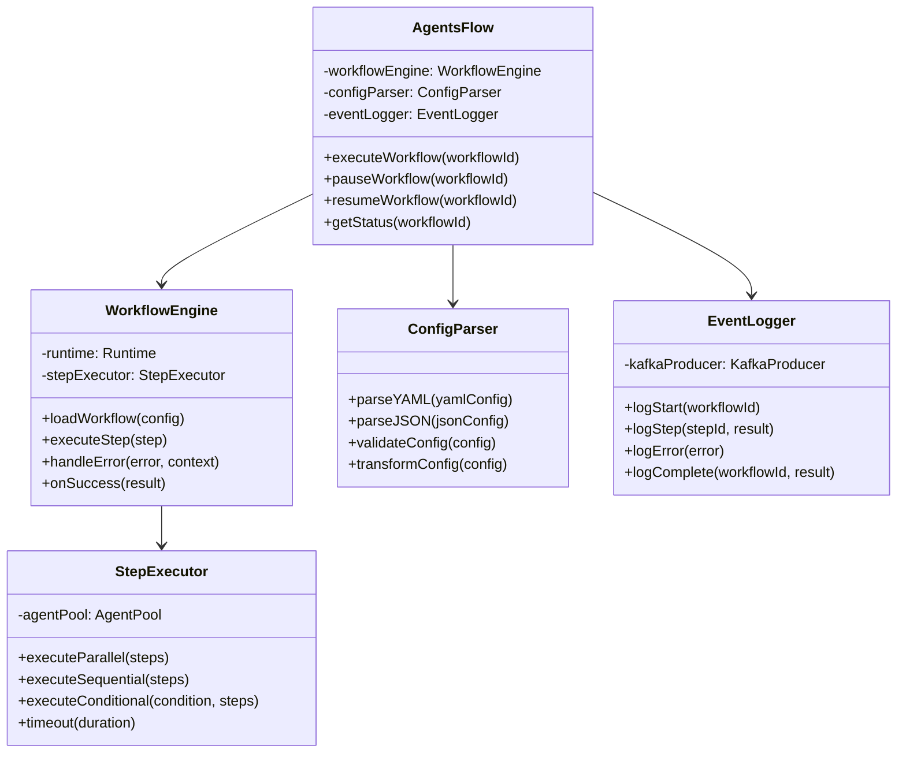
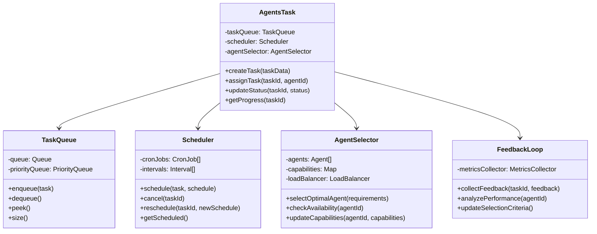
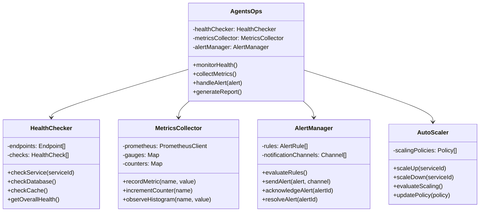
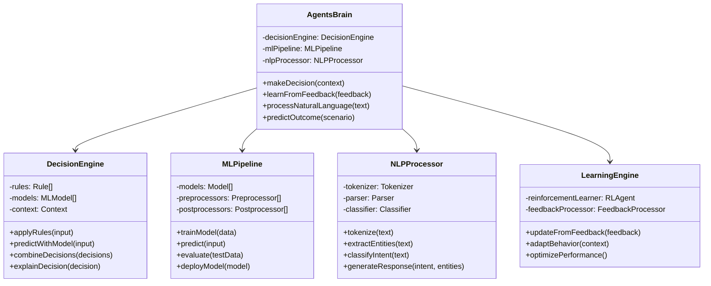
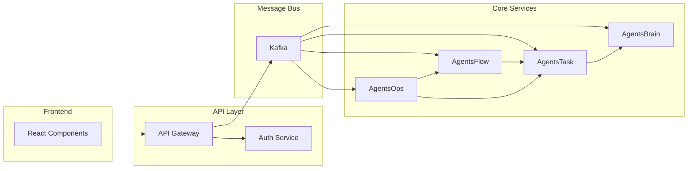

# Component Diagram

AgentsPalace platformunun bileşen mimarisi ve sınıf yapıları.

## Frontend Components (React/Next.js)



## Backend Core Components



## AgentsFlow Components



## AgentsTask Components



## AgentsOps Components



## AgentsBrain Components



## Data Models

```mermaid
classDiagram
    class User {
        +id: UUID
        +email: string
        +passwordHash: string
        +role: UserRole
        +createdAt: Date
        +lastLoginAt: Date
        +isActive: boolean
    }
    
    class Workflow {
        +id: UUID
        +name: string
        +description: string
        +config: WorkflowConfig
        +status: WorkflowStatus
        +createdBy: UUID
        +version: number
        +tags: string[]
    }
    
    class Task {
        +id: UUID
        +workflowId: UUID
        +agentId: string
        +type: TaskType
        +status: TaskStatus
        +priority: Priority
        +inputData: JSON
        +outputData: JSON
        +scheduledAt: Date
        +startedAt: Date
        +completedAt: Date
        +retryCount: number
    }
    
    class Agent {
        +id: string
        +name: string
        +type: AgentType
        +capabilities: Capability[]
        +status: AgentStatus
        +lastHeartbeat: Date
        +version: string
        +configuration: JSON
    }
    
    class Metric {
        +id: UUID
        +name: string
        +value: number
        +unit: string
        +timestamp: Date
        +tags: Map
        +source: string
    }
    
    User ||--o{ Workflow : creates
    Workflow ||--|{ Task : contains
    Task ||--o| Agent : assigned_to
    Agent ||--o{ Metric : generates
```

## Interface Definitions

```typescript
// Core interfaces
interface IWorkflowEngine {
  executeWorkflow(workflowId: string): Promise<WorkflowResult>;
  pauseWorkflow(workflowId: string): Promise<void>;
  resumeWorkflow(workflowId: string): Promise<void>;
  getStatus(workflowId: string): Promise<WorkflowStatus>;
}

interface ITaskManager {
  createTask(taskData: CreateTaskRequest): Promise<Task>;
  assignTask(taskId: string, agentId: string): Promise<void>;
  updateStatus(taskId: string, status: TaskStatus): Promise<void>;
  getProgress(taskId: string): Promise<TaskProgress>;
}

interface IAgentSelector {
  selectOptimalAgent(requirements: AgentRequirements): Promise<Agent>;
  checkAvailability(agentId: string): Promise<boolean>;
  updateCapabilities(agentId: string, capabilities: Capability[]): Promise<void>;
}

interface IDecisionEngine {
  makeDecision(context: DecisionContext): Promise<Decision>;
  learnFromFeedback(feedback: Feedback): Promise<void>;
  explainDecision(decision: Decision): Promise<Explanation>;
}
```

## Component Communication



---

**Son Güncelleme:** 2025-01-22  
**Versiyonu:** v1.0  
**Sorumlu:** AgentsPalace Architecture Team
