# Data Flow Diagram

AgentsPalace platformundaki veri akışları ve işlem süreçleri.

## High-Level Data Flow

```mermaid
flowchart TD
    subgraph "User Interaction"
        USER[👤 User]
        FRONTEND[🌐 Frontend<br/>Next.js App]
    end
    
    subgraph "API Layer"
        GATEWAY[🚪 API Gateway]
        AUTH[🔐 Authentication]
        RATE[⏱️ Rate Limiter]
    end
    
    subgraph "Message Bus"
        KAFKA[📨 Kafka<br/>Event Streaming]
    end
    
    subgraph "Core Services"
        FLOW[🔄 AgentsFlow]
        TASK[📋 AgentsTask]
        OPS[🔧 AgentsOps]
        MAP[🗺️ AgentsMap]
        BRAIN[🧠 AgentsBrain]
    end
    
    subgraph "Data Storage"
        POSTGRES[(🗄️ PostgreSQL<br/>Primary DB)]
        REDIS[(⚡ Redis<br/>Cache)]
        S3[(📁 S3<br/>File Storage)]
    end
    
    subgraph "External Services"
        AI_API[🤖 AI Services]
        NOTIF[📢 Notifications]
    end
    
    %% User flow
    USER --> FRONTEND
    FRONTEND --> GATEWAY
    
    %% API processing
    GATEWAY --> AUTH
    AUTH --> RATE
    RATE --> KAFKA
    
    %% Event distribution
    KAFKA --> FLOW
    KAFKA --> TASK
    KAFKA --> OPS
    KAFKA --> MAP
    KAFKA --> BRAIN
    
    %% Data persistence
    FLOW --> POSTGRES
    TASK --> POSTGRES
    OPS --> POSTGRES
    MAP --> POSTGRES
    BRAIN --> POSTGRES
    
    %% Caching
    FLOW --> REDIS
    TASK --> REDIS
    BRAIN --> REDIS
    
    %% File handling
    FRONTEND --> S3
    
    %% External integrations
    BRAIN --> AI_API
    OPS --> NOTIF
    
    %% Response flow
    FLOW --> KAFKA
    TASK --> KAFKA
    OPS --> KAFKA
    MAP --> KAFKA
    BRAIN --> KAFKA
    
    KAFKA --> GATEWAY
    GATEWAY --> FRONTEND
    FRONTEND --> USER
```



## Detailed Flow Scenarios

### 1. User Registration & Authentication Flow


### 2. Workflow Execution Flow


### 3. Monitoring & Alerting Flow


## Data Types & Formats

### Event Messages (Kafka)

```json
{
  "eventType": "workflow.started",
  "timestamp": "2025-01-22T10:30:00Z",
  "userId": "user_123",
  "workflowId": "wf_456",
  "data": {
    "workflowName": "Customer Onboarding",
    "priority": "high",
    "estimatedDuration": "15m"
  },
  "correlationId": "corr_789"
}
```

### Database Entities

```sql
-- Users table
CREATE TABLE users (
    id UUID PRIMARY KEY,
    email VARCHAR(255) UNIQUE NOT NULL,
    password_hash VARCHAR(255) NOT NULL,
    created_at TIMESTAMP DEFAULT NOW(),
    updated_at TIMESTAMP DEFAULT NOW()
);

-- Workflows table
CREATE TABLE workflows (
    id UUID PRIMARY KEY,
    name VARCHAR(255) NOT NULL,
    config JSONB NOT NULL,
    status VARCHAR(50) DEFAULT 'draft',
    created_by UUID REFERENCES users(id),
    created_at TIMESTAMP DEFAULT NOW(),
    updated_at TIMESTAMP DEFAULT NOW()
);

-- Tasks table
CREATE TABLE tasks (
    id UUID PRIMARY KEY,
    workflow_id UUID REFERENCES workflows(id),
    agent_id VARCHAR(255),
    status VARCHAR(50) DEFAULT 'pending',
    input_data JSONB,
    output_data JSONB,
    created_at TIMESTAMP DEFAULT NOW(),
    completed_at TIMESTAMP
);
```

### Cache Structures (Redis)

```redis
# User sessions
SET user:session:token_123 "user_id:456" EX 3600

# Workflow status
HSET workflow:status:wf_456 
  status "running" 
  progress "45%" 
  current_step "step_3"

# Agent capabilities
SADD agent:capabilities:agent_123 
  "data_processing" 
  "api_integration" 
  "notification_sending"
```

## Performance Considerations

### 1. Data Partitioning
- **Kafka Topics**: Partitioned by user_id for load distribution
- **PostgreSQL**: Partitioned by date for large tables
- **Redis**: Sharded by key prefix

### 2. Caching Strategy
- **L1 Cache**: Application-level caching (in-memory)
- **L2 Cache**: Redis for shared data
- **L3 Cache**: CDN for static assets

### 3. Data Retention
- **Kafka**: 7 days retention for events
- **PostgreSQL**: Archive old data to cold storage
- **Redis**: TTL for temporary data

## Security & Privacy

### 1. Data Encryption
- **In Transit**: TLS 1.3 for all communications
- **At Rest**: AES-256 encryption for sensitive data
- **API Keys**: Encrypted storage in database

### 2. Access Control
- **Role-Based**: User roles and permissions
- **API Rate Limiting**: Per-user quotas
- **Audit Logging**: All data access logged

### 3. Data Privacy
- **GDPR Compliance**: Right to deletion
- **Data Minimization**: Store only necessary data
- **Anonymization**: PII anonymization for analytics

---

**Son Güncelleme:** 2025-01-22  
**Versiyonu:** v1.0  
**Sorumlu:** AgentsPalace Architecture Team
