# Deployment Diagram

AgentsPalace platformunun production deployment mimarisi ve infrastructure bileşenleri.

## Production Architecture


## Container Architecture (Docker/Kubernetes)

```mermaid
flowchart TB
    subgraph "Kubernetes Cluster"
        subgraph "Ingress"
            ING[📥 Ingress Controller<br/>Nginx Ingress]
        end
        
        subgraph "Frontend Namespace"
            subgraph "Next.js Deployment"
                WEBPOD1[🌐 Web Pod 1<br/>Next.js Container]
                WEBPOD2[🌐 Web Pod 2<br/>Next.js Container]
                WEBPOD3[🌐 Web Pod 3<br/>Next.js Container]
            end
            WEBSVC[🔌 Web Service<br/>LoadBalancer]
        end
        
        subgraph "API Namespace"
            subgraph "Gateway Deployment"
                GWPOD1[🚪 Gateway Pod 1<br/>API Container]
                GWPOD2[🚪 Gateway Pod 2<br/>API Container]
            end
            GWSVC[🔌 Gateway Service<br/>ClusterIP]
        end
        
        subgraph "Services Namespace"
            subgraph "Flow Deployment"
                FLOWPOD1[🔄 Flow Pod 1]
                FLOWPOD2[🔄 Flow Pod 2]
            end
            FLOWSVC[🔌 Flow Service]
            
            subgraph "Task Deployment"
                TASKPOD1[📋 Task Pod 1]
                TASKPOD2[📋 Task Pod 2]
            end
            TASKSVC[🔌 Task Service]
            
            subgraph "Ops Deployment"
                OPSPOD1[🔧 Ops Pod 1]
            end
            OPSSVC[🔌 Ops Service]
            
            subgraph "Brain Deployment"
                BRAINPOD1[🧠 Brain Pod 1]
            end
            BRAINSVC[🔌 Brain Service]
        end
        
        subgraph "Data Namespace"
            subgraph "Kafka StatefulSet"
                KAFKAPOD1[📨 Kafka Pod 1]
                KAFKAPOD2[📨 Kafka Pod 2]
                KAFKAPOD3[📨 Kafka Pod 3]
            end
            KAFKASVC[🔌 Kafka Service]
            
            subgraph "PostgreSQL StatefulSet"
                DBPOD1[(🗄️ DB Pod 1<br/>Master)]
                DBPOD2[(🗄️ DB Pod 2<br/>Replica)]
            end
            DBSVC[🔌 DB Service]
            
            subgraph "Redis StatefulSet"
                REDISPOD1[(⚡ Redis Pod 1<br/>Master)]
                REDISPOD2[(⚡ Redis Pod 2<br/>Replica)]
            end
            REDISSVC[🔌 Redis Service]
        end
        
        subgraph "Monitoring Namespace"
            PROMPOD[📊 Prometheus Pod]
            GRAFPOD[📈 Grafana Pod]
            ELKPOD[📋 ELK Pod]
        end
        
        subgraph "Storage"
            PV1[💾 PersistentVolume 1<br/>DB Data]
            PV2[💾 PersistentVolume 2<br/>Kafka Data]
            PV3[💾 PersistentVolume 3<br/>Redis Data]
        end
    end
    
    %% Ingress routing
    ING --> WEBSVC
    ING --> GWSVC
    
    %% Service to Pod connections
    WEBSVC --> WEBPOD1
    WEBSVC --> WEBPOD2
    WEBSVC --> WEBPOD3
    
    GWSVC --> GWPOD1
    GWSVC --> GWPOD2
    
    FLOWSVC --> FLOWPOD1
    FLOWSVC --> FLOWPOD2
    
    TASKSVC --> TASKPOD1
    TASKSVC --> TASKPOD2
    
    OPSSVC --> OPSPOD1
    BRAINSVC --> BRAINPOD1
    
    KAFKASVC --> KAFKAPOD1
    KAFKASVC --> KAFKAPOD2
    KAFKASVC --> KAFKAPOD3
    
    DBSVC --> DBPOD1
    DBSVC --> DBPOD2
    
    REDISSVC --> REDISPOD1
    REDISSVC --> REDISPOD2
    
    %% Persistent storage
    DBPOD1 --> PV1
    DBPOD2 --> PV1
    KAFKAPOD1 --> PV2
    KAFKAPOD2 --> PV2
    KAFKAPOD3 --> PV2
    REDISPOD1 --> PV3
    REDISPOD2 --> PV3
```



## Infrastructure Specifications

### Resource Allocation

| Component | CPU | Memory | Storage | Replicas |
|-----------|-----|--------|---------|----------|
| Next.js Web | 500m | 512Mi | - | 3 |
| API Gateway | 1000m | 1Gi | - | 2 |
| AgentsFlow | 2000m | 2Gi | - | 2 |
| AgentsTask | 1000m | 1Gi | - | 2 |
| AgentsOps | 500m | 512Mi | - | 1 |
| AgentsBrain | 4000m | 4Gi | - | 1 |
| Kafka | 1000m | 2Gi | 100Gi | 3 |
| PostgreSQL | 2000m | 4Gi | 200Gi | 2 |
| Redis | 500m | 1Gi | 20Gi | 2 |
| Prometheus | 1000m | 2Gi | 50Gi | 1 |
| Grafana | 200m | 256Mi | 5Gi | 1 |

### Network Configuration

```yaml
# Kubernetes Network Policies
apiVersion: networking.k8s.io/v1
kind: NetworkPolicy
metadata:
  name: agentspalace-network-policy
spec:
  podSelector: {}
  policyTypes:
  - Ingress
  - Egress
  ingress:
  - from:
    - namespaceSelector:
        matchLabels:
          name: frontend
    - namespaceSelector:
        matchLabels:
          name: api
    ports:
    - protocol: TCP
      port: 8080
  egress:
  - to:
    - namespaceSelector:
        matchLabels:
          name: data
    ports:
    - protocol: TCP
      port: 5432  # PostgreSQL
    - protocol: TCP
      port: 6379  # Redis
    - protocol: TCP
      port: 9092  # Kafka
```

### Security Configuration

```yaml
# Service Account for AgentsPalace
apiVersion: v1
kind: ServiceAccount
metadata:
  name: agentspalace-service-account
  namespace: services
---
# Role for accessing resources
apiVersion: rbac.authorization.k8s.io/v1
kind: Role
metadata:
  namespace: services
  name: agentspalace-role
rules:
- apiGroups: [""]
  resources: ["pods", "services"]
  verbs: ["get", "list", "watch"]
---
# RoleBinding
apiVersion: rbac.authorization.k8s.io/v1
kind: RoleBinding
metadata:
  name: agentspalace-rolebinding
  namespace: services
subjects:
- kind: ServiceAccount
  name: agentspalace-service-account
  namespace: services
roleRef:
  kind: Role
  name: agentspalace-role
  apiGroup: rbac.authorization.k8s.io
```

## CI/CD Pipeline

```mermaid
flowchart LR
    subgraph "Source Control"
        GIT[📝 GitHub Repository]
    end
    
    subgraph "CI Pipeline"
        BUILD[🔨 Build<br/>GitHub Actions]
        TEST[🧪 Test<br/>Unit & Integration]
        SCAN[🔍 Security Scan<br/>Snyk/SonarQube]
        PACKAGE[📦 Package<br/>Docker Build]
    end
    
    subgraph "Registry"
        REG[📋 Container Registry<br/>Docker Hub/ECR]
    end
    
    subgraph "CD Pipeline"
        DEPLOY_STAGE[🚀 Deploy Staging<br/>ArgoCD]
        E2E[🎯 E2E Tests<br/>Playwright]
        DEPLOY_PROD[🌟 Deploy Production<br/>ArgoCD]
    end
    
    subgraph "Environments"
        STAGING[🧪 Staging Environment]
        PRODUCTION[🌟 Production Environment]
    end
    
    GIT --> BUILD
    BUILD --> TEST
    TEST --> SCAN
    SCAN --> PACKAGE
    PACKAGE --> REG
    REG --> DEPLOY_STAGE
    DEPLOY_STAGE --> STAGING
    STAGING --> E2E
    E2E --> DEPLOY_PROD
    DEPLOY_PROD --> PRODUCTION
```



## Monitoring & Alerting Setup

```yaml
# Prometheus Configuration
global:
  scrape_interval: 15s
  evaluation_interval: 15s

scrape_configs:
  - job_name: 'agentspalace-api'
    static_configs:
      - targets: ['api-service:8080']
    metrics_path: /metrics
    scrape_interval: 5s

  - job_name: 'agentspalace-services'
    kubernetes_sd_configs:
      - role: pod
        namespaces:
          names:
            - services
    relabel_configs:
      - source_labels: [__meta_kubernetes_pod_annotation_prometheus_io_scrape]
        action: keep
        regex: true

rule_files:
  - "alerts.yml"

alerting:
  alertmanagers:
    - static_configs:
        - targets:
          - alertmanager:9093
```

## Backup & Disaster Recovery


---

**Son Güncelleme:** 2025-01-22  
**Versiyonu:** v1.0  
**Sorumlu:** AgentsPalace DevOps Team
