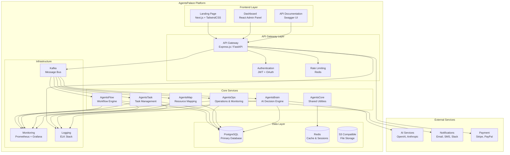

# System Architecture Diagram

Bu diyagram, AgentsPalace platformunun temel bileşenlerini ve aralarındaki ilişkileri gösterir.

## Platform Overview

## Component Responsibilities

### Frontend Layer
- **Landing Page**: Marketing site, lead generation
- **Dashboard**: Admin panel, monitoring, configuration
- **API Documentation**: Interactive API docs

### API Gateway Layer
- **API Gateway**: Request routing, load balancing
- **Authentication**: User management, JWT tokens
- **Rate Limiting**: API quota management

### Core Services
- **AgentsFlow**: Workflow definition and execution
- **AgentsTask**: Task scheduling and management
- **AgentsOps**: System operations and health monitoring
- **AgentsMap**: Resource and capability mapping
- **AgentsBrain**: AI-powered decision making
- **AgentsCore**: Shared libraries and utilities

### Data Layer
- **PostgreSQL**: Primary relational database
- **Redis**: Caching, session storage, pub/sub
- **S3 Storage**: File uploads, static assets

### Infrastructure
- **Kafka**: Event streaming, microservice communication
- **Monitoring**: Metrics collection and alerting
- **Logging**: Centralized log aggregation

## Technology Stack

| Layer | Technology | Purpose |
|-------|------------|---------|
| Frontend | Next.js 15, TailwindCSS, Framer Motion | Modern web interface |
| API | Express.js / FastAPI | RESTful API services |
| Messaging | Apache Kafka | Event-driven architecture |
| Database | PostgreSQL 15+ | Primary data storage |
| Cache | Redis 7+ | Session & data caching |
| Storage | MinIO / AWS S3 | File storage |
| Monitoring | Prometheus, Grafana | Metrics & dashboards |
| Logging | Elasticsearch, Logstash, Kibana | Log analysis |

## Data Flow

1. **User Request**: Frontend → API Gateway → Authentication
2. **Event Publishing**: API Gateway → Kafka → Core Services
3. **Data Processing**: Core Services → Database → Cache
4. **Response**: Core Services → Kafka → API Gateway → Frontend
5. **Monitoring**: All services → Prometheus → Grafana
6. **Logging**: All services → ELK Stack

## Scalability Considerations

- **Horizontal Scaling**: Kafka partitioning, service replicas
- **Load Balancing**: API Gateway with multiple instances
- **Database Scaling**: Read replicas, connection pooling
- **Cache Strategy**: Redis clustering, CDN integration
- **Monitoring**: Auto-scaling based on metrics

---

**Son Güncelleme:** 2025-01-22  
**Versiyonu:** v1.0  
**Sorumlu:** AgentsPalace Architecture Team
