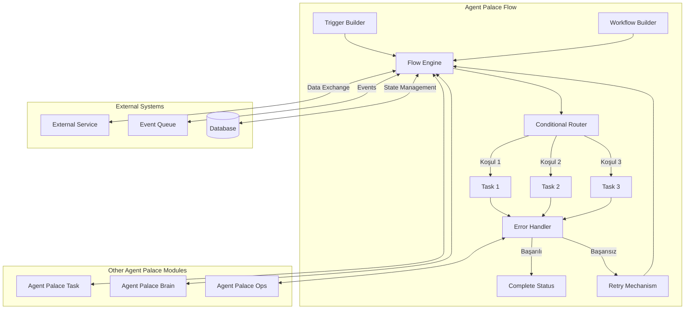

# Agent Palace Flow Detaylı Sayfa Spesifikasyonu

## Genel Bakış
- **Modülün Amacı:** Agent Palace Flow, karmaşık iş akışlarını kolayca tasarlama, otomatikleştirme ve izleme imkanı sağlayan kapsamlı bir orkestrasyon çözümüdür. Flow modülü, yapay zeka ajanlarının belirli akışlar içinde nasıl çalışacağını, birbirleriyle nasıl iletişim kuracağını ve iş süreçlerini nasıl otomatikleştireceğini tanımlamanıza olanak tanır.
- **Hedef Kitle:** Operasyon yöneticileri, süreç tasarımcıları, teknik ekip liderleri ve iş süreçlerini otomatikleştirmek isteyen her seviyeden kullanıcı.
- **Farklılaştırıcı Özellikler:** Sezgisel sürükle-bırak arayüzü, 100'den fazla hazır şablon, gerçek zamanlı izleme kapasitesi, otomatik hata yönetimi ve koşullu dallanma mantığı ile rakiplerinden ayrılır.
- **Slogan:** "Akışkan Zeka, Kusursuz Operasyon"

## Temel Özellikler
- **Görsel Akış Tasarımcısı:** Kod yazmadan, sürükle-bırak arayüzü ile karmaşık iş akışlarını dakikalar içinde tasarlayın. Zengin bileşen kütüphanesi ve özelleştirilebilir şablonlar ile süreci hızlandırın.
- **Gerçek Zamanlı İzleme Paneli:** Tüm akış adımlarını anlık olarak takip edin, darboğazları tespit edin ve aktif akışlara anında müdahale ederek sorunları çözün.
- **Akıllı Hata Yönetimi:** Önceden tanımlanmış kurallar ve tam yapılandırılabilir hata yönetim stratejileri ile sistem kesintilerini minimuma indirin ve iş sürekliliğini sağlayın.
- **Dinamik Koşullu Yönlendirme:** Değişken koşullara göre akışları farklı kollara ayırın, veri tabanlı kararlar alın ve kaynakları optimum şekilde kullanın.
- **Gelişmiş Tetikleyici Sistemi:** Zamana bağlı, olaya bağlı veya veri durumuna bağlı tetikleyicilerle akışlarınızı başlatın ve sonlandırın, tam otomasyon sağlayın.

## Nasıl Çalışır



**Adım Adım İşleyiş:**

1. **Tetikleyici Tanımlama:** Workflow Builder ile tetikleyiciler (zaman, olay veya durum bazlı) tanımlanır.
2. **Akış Tasarımı:** Görsel arayüz kullanılarak, akış adımları, görevler ve koşullar belirlenir.
3. **Koşul Yönetimi:** Conditional Router, gelen verilere göre akışı farklı kollara ayırır.
4. **Görev Yürütme:** Task modülü ile entegre çalışarak belirlenen görevleri yürütür.
5. **Hata Kontrolü:** Görev yürütmeleri sürekli izlenir, hata durumunda Error Handler devreye girer.
6. **Yeniden Deneme:** Gerektiğinde belirli adımlar otomatik olarak tekrarlanır.
7. **Tamamlama:** Başarılı tamamlanan akışlar raporlanır ve arşivlenir.

**Entegrasyon:**
Agent Palace Flow, diğer modüllerle tam entegrasyon içinde çalışır:
- **Task Modülü:** Görevlerin yürütülmesi için
- **Brain Modülü:** Karar verme süreçlerini optimize etmek için
- **Ops Modülü:** İzleme ve müdahale için
- **Map Modülü:** Coğrafi konuma dayalı akışlar için

## Alt Modüller (Sub-modules)

### Flow Engine
- **Ana İşlevi:** Tasarlanmış akışları yürüten ana motor
- **Özellikler:**
  - Yüksek performanslı işlem yürütme
  - İş parçacığı (thread) yönetimi
  - State persistence ve recovery
  - İleri düzey logging ve debug

### Workflow Builder
- **Ana İşlevi:** Akışların görsel olarak tasarlandığı arayüz
- **Özellikler:**
  - Sürükle-bırak UI
  - Şablon kütüphanesi
  - Versiyon kontrolü
  - Kolaboratif tasarım imkanı
  - Import/export özellikleri

### Trigger Manager
- **Ana İşlevi:** Akışların başlamasını tetikleyen olayları yöneten sistem
- **Özellikler:**
  - Zaman bazlı tetikleyiciler (CRON)
  - Olay bazlı tetikleyiciler (webhooks)
  - Veri durumu bazlı tetikleyiciler
  - Kuyruklama ve öncelik belirleme

### Conditional Router
- **Ana İşlevi:** Dinamik koşullara göre akış dallandırma sistemi
- **Özellikler:**
  - Karmaşık koşul mantığı
  - A/B testing
  - İstatistiksel yönlendirme
  - Yük dengeleme

### Error Handler
- **Ana İşlevi:** Akış sırasında oluşan hataları yöneten sistem
- **Özellikler:**
  - Hata sınıflandırma
  - Otomatik düzeltme stratejileri
  - Yeniden deneme politikaları
  - Failover mekanizmaları
  - Bildirim ve alarm sistemi

## Teknik Özellikler

### Kullanılan Teknolojiler
- **Backend:** Node.js, TypeScript
- **Workflow Engine:** Netflix Conductor (özelleştirilmiş)
- **State Management:** Redis, PostgreSQL
- **Message Bus:** Apache Kafka
- **Monitoring:** Prometheus, Grafana
- **Frontend:** React, Framer Motion, TailwindCSS

### API Endpoints (Örnek)

```json
// Flow oluşturma
POST /api/v1/flows
{
  "name": "müşteri-onboarding-süreci",
  "description": "Yeni müşteri kayıt ve onboarding sürecini yönetir",
  "triggers": [
    {
      "type": "event",
      "eventName": "new_customer_registered"
    }
  ],
  "steps": [...]
}

// Flow listesi alma
GET /api/v1/flows?status=active&limit=20&offset=0

// Akış detayı alma
GET /api/v1/flows/{flowId}

// Akış çalıştırma
POST /api/v1/flows/{flowId}/execute
{
  "inputData": {...}
}

// Akış durumunu kontrol etme
GET /api/v1/executions/{executionId}
```

### Veri Modelleri

```typescript
interface Flow {
  id: string;
  name: string;
  description: string;
  version: number;
  status: 'draft' | 'active' | 'archived';
  createdBy: string;
  createdAt: Date;
  updatedAt: Date;
  triggers: Trigger[];
  steps: Step[];
  errorHandlers: ErrorHandler[];
}

interface Trigger {
  id: string;
  type: 'schedule' | 'event' | 'data' | 'manual';
  config: object;
}

interface Step {
  id: string;
  name: string;
  type: 'task' | 'decision' | 'parallel' | 'join';
  config: object;
  nextSteps: string[];
}

interface ErrorHandler {
  stepId: string;
  strategy: 'retry' | 'skip' | 'terminate' | 'alternate';
  config: object;
}
```

### Gereksinimler ve Bağımlılıklar
- Node.js 18+ runtime
- PostgreSQL 15+
- Redis 7+
- Apache Kafka 3.0+
- Agent Palace Core modülü
- Agent Palace Task modülü (opsiyonel)

## Kullanım Senaryoları

### Senaryo 1: Çoklu Departman İçeren Müşteri Onboarding Süreci

**Problem:** Bir fintech şirketi, yeni müşterilerin onboarding sürecinde çoklu departmanların (uyum, risk, müşteri hizmetleri) onaylarını gerektiren karmaşık bir sürece sahip. Manuel işlemler hatalara ve gecikmelere neden oluyor.

**Çözüm:** Agent Palace Flow ile tasarlanan otomatik bir akış:
1. Müşteri kaydı alındığında otomatik tetiklenir
2. Belge doğrulama adımlarını otomatize eder
3. İlgili departmanlara paralel görevler atar
4. Departman onaylarını bekler ve takip eder
5. Eksik bilgi/belge durumlarını otomatik yönetir
6. Onay tamamlandığında hesap aktivasyonu ve bildirim işlemlerini gerçekleştirir

**Sonuç:** Onboarding süresi %70 azaldı, müşteri memnuniyeti arttı, operasyonel hatalar %90 oranında düştü.

### Senaryo 2: Üretim Hattı Kalite Kontrol Otomasyonu

**Problem:** Bir üretim tesisinde, ürünlerin kalite kontrol süreçleri manuel yürütülüyor, insan hatasına açık ve zaman alıyor.

**Çözüm:** Agent Palace Flow ile geliştirilen kalite kontrol akışı:
1. IoT sensörlerinden gelen verileri gerçek zamanlı analiz eder
2. Belirli eşik değerlerin aşılması durumunda özel kontrol rutinlerini başlatır
3. Kalite sorunlarını otomatik olarak sınıflandırır
4. Belirlenen soruna göre doğru departmana bildirim gönderir
5. Düzeltici aksiyonları takip eder ve raporlar

**Sonuç:** Kalite kontrol maliyeti %40 düştü, ürün kusurları %25 azaldı, üretim hızı %15 arttı.

### Senaryo 3: Dinamik Fiyatlandırma Stratejisi

**Problem:** E-ticaret şirketi, rakip fiyatları, envanter durumu ve talep dinamiklerine göre fiyatlarını güncellemek istiyor ancak manuel süreç çok zaman alıyor.

**Çözüm:** Agent Palace Flow ile oluşturulan dinamik fiyatlandırma akışı:
1. Rekabet analizi yapan crawler'lar tarafından tetiklenir
2. Envanter seviyesi ve satış hızını analiz eder
3. Belirli kurallara göre optimum fiyatı hesaplar
4. Kar marjı kontrollerini otomatik yapar
5. Onay gerektiren durumlarda yöneticiye bildirim gönderir
6. Onay sonrası fiyatları otomatik günceller

**Sonuç:** Fiyat güncelleme süresi saatlerden dakikalara indi, kar marjı %12 arttı, stok tükenme oranı %30 azaldı.

## Demo ve Ekran Görüntüleri

### Workflow Builder UI Mockup

```
+-----------------------------------------------------------------------+
|  Agent Palace Flow - Workflow Builder                           [-][x] |
+-----------------------------------------------------------------------+
| [Save] [Deploy] [Test]     | My Workflow v1.2                         |
+---------------------------+ +---------------------------------------+ |
| Components                | |                                       | |
| +-----------------------+ | |    +--------+      +-----------+      | |
| | Triggers              | | |    |        |      |           |      | |
| | [Event Trigger     ] >| | |    | Start  |----->| Check     |      | |
| | [Schedule Trigger  ] >| | |    | Event  |      | Condition |      | |
| | [Data Trigger      ] >| | |    |        |      |           |      | |
| +-----------------------+ | |    +--------+      +-----------+      | |
| | Steps                 | | |                         |             | |
| | [Task              ] >| | |                         |             | |
| | [Decision Point    ] >| | |                         V             | |
| | [Parallel Tasks    ] >| | |     +-----------+   +-----------+     | |
| | [Join              ] >| | |     |           |   |           |     | |
| +-----------------------+ | |     | Process A |<--| Decision   |     | |
| | Error Handlers        | | |     |           |   | Point      |     | |
| | [Retry            ]  >| | |     +-----------+   +-----------+     | |
| | [Skip             ]  >| | |                         |             | |
| | [Alternate Path   ]  >| | |                         V             | |
| +-----------------------+ | |     +-----------+                     | |
| | Integrations          | | |     |           |                     | |
| | [API Call         ]  >| | |     | Process B |                     | |
| | [DB Operation     ]  >| | |     |           |                     | |
| | [Message Queue    ]  >| | |     +-----------+                     | |
| +-----------------------+ | |                         |             | |
|                           | |                         V             | |
| Properties                | |     +-----------+                     | |
| +----------------+        | |     |           |                     | |
| | Name: Process A|        | |     | Complete  |                     | |
| | Type: Task     |        | |     |           |                     | |
| | Timeout: 30s   |        | |     +-----------+                     | |
| | Retry: 3       |        | |                                       | |
| | Priority: High |        | +---------------------------------------+ |
| +----------------+        |                                           |
+---------------------------+-------------------------------------------+
```

### Monitoring Dashboard Mockup

```
+-----------------------------------------------------------------------+
|  Agent Palace Flow - Monitor                                     [-][x] |
+-----------------------------------------------------------------------+
| Active Flows: 128 | Completed: 2,456 | Failed: 32                      |
+----------+--------+----------------+---------------+------------------+|
| Status   | Flow Name             | Started          | Duration        ||
+----------+------------------------+-----------------+------------------+|
| [ACTIVE] | customer-onboarding-34 | 22/06/25 14:23  | 12m 34s         ||
| [ERROR]  | payment-verification-56| 22/06/25 14:20  | 15m 08s         ||
| [ACTIVE] | order-fulfillment-112  | 22/06/25 14:18  | 17m 22s         ||
| [PAUSED] | inventory-update-28    | 22/06/25 14:15  | 20m 47s         ||
| [ACTIVE] | marketing-campaign-7   | 22/06/25 14:10  | 25m 03s         ||
+----------+------------------------+-----------------+------------------+|
|                                                                       ||
| [Flow Details: customer-onboarding-34]                                ||
|                                                                       ||
|  +--------+      +-----------+     +---------+     +-----------+      ||
|  | Verify |      | Credit    |     | Account |     | Welcome   |      ||
|  | Docs   |--✓-->| Check     |--✓->| Setup   |---->| Email     |      ||
|  +--------+      +-----------+     +---------+     +-----------+      ||
|                                                                       ||
| Current Step: Account Setup (3/4)                                     ||
| Step Status: IN_PROGRESS - Running for: 4m 12s                        ||
| Variables:                                                            ||
| - customer_id: "C-38291"                                              ||
| - verification_level: "full"                                          ||
| - credit_score: 720                                                   ||
|                                                                       ||
| [Resume] [Pause] [Terminate] [Modify Variables]                       ||
+-----------------------------------------------------------------------+
```

## Landing Page Entegrasyonu

### URL Yapısı
- **Ana URL:** `/modules/flow`
- **Demo Sayfası:** `/modules/flow/demo`
- **Dokümantasyon:** `/modules/flow/docs`
- **Kullanım Senaryoları:** `/modules/flow/use-cases`

### Ana Sayfadan Erişim

1. **Üst Menü**:
   ```
   +-----------------------------------------------------------+
   | Agent Palace   Solutions ▼   Docs   Pricing   Get Started |
   |               +------------+                              |
   |               | Flow       |                              |
   |               | Task       |                              |
   |               | Ops        |                              |
   |               | Map        |                              |
   |               | Brain      |                              |
   |               | Core       |                              |
   |               | Voice      |                              |
   |               +------------+                              |
   +-----------------------------------------------------------+
   ```

2. **Modül Galerisi**:
   ```
   +-----------------------------------------------------------+
   |                     OUR MODULES                           |
   |                                                           |
   | +----------+  +----------+  +----------+  +----------+    |
   | |          |  |          |  |          |  |          |    |
   | |   FLOW   |  |   TASK   |  |   OPS    |  |   MAP    |    |
   | |          |  |          |  |          |  |          |    |
   | |Automate  |  |Manage    |  |Monitor & |  |Location  |    |
   | |workflows |  |tasks     |  |optimize  |  |tracking  |    |
   | |          |  |          |  |          |  |          |    |
   | |Learn More|  |Learn More|  |Learn More|  |Learn More|    |
   | +----------+  +----------+  +----------+  +----------+    |
   |                                                           |
   | +----------+  +----------+  +----------+                  |
   | |          |  |          |  |          |                  |
   | |  BRAIN   |  |  CORE    |  |  VOICE   |                  |
   | |          |  |          |  |          |                  |
   | |Decision  |  |Common    |  |Voice     |                  |
   | |engine    |  |utilities |  |interface |                  |
   | |          |  |          |  |          |                  |
   | |Learn More|  |Learn More|  |Learn More|                  |
   | +----------+  +----------+  +----------+                  |
   +-----------------------------------------------------------+
   ```

3. **Call-To-Action Düğmeleri**:
   - Ana sayfadaki FLOW kartında: "Learn More" butonu → `/modules/flow`
   - Flow detay sayfasında:
     - "Demoyu Görüntüle" → `/modules/flow/demo`
     - "Dokümantasyonu İncele" → `/modules/flow/docs`
     - "Ücretsiz Deneme" → `/get-started?module=flow`

## Geliştirme Notları

### Bu Sayfanın Teknik Gereksinimleri
- Next.js App Router yapısında `/modules/flow` sayfası
- Blade Runner 2049 estetiğine uygun tasarım elementleri
- Responsive layout (mobil, tablet, masaüstü)
- Interactive flowchart gösterimi için Mermaid.js
- Animasyonlu UI elementleri için Framer Motion

### Kullanılacak Componentler
- `HeroSection`: Modül başlık ve tanıtımı
- `FeatureGrid`: Özellikler tablosu
- `DiagramViewer`: İnteraktif diyagram gösterimi
- `SubModuleList`: Alt modül kartları
- `UseCaseAccordion`: Kullanım senaryoları açılır menüsü
- `MockupDisplay`: UI mockup gösterimi
- `CTASection`: Call to Action butonları bölümü
- `TechSpecTable`: Teknik özellikler tablosu

### Responsive Tasarım Notları
- **Mobil (< 640px):** Tek kolon düzeni, collapse edilebilir bölümler
- **Tablet (640px - 1024px):** İki kolon düzeni, daha fazla görsel içerik
- **Masaüstü (> 1024px):** Üç kolon düzeni, yan panel navigasyonu

**Önemli:** Flow Builder ve Monitor görsellerinde mobil uyumluluk için özel düzenlemeler yapılacak, karmaşık arayüzler için yatay kaydırma seçeneği eklenecek.
