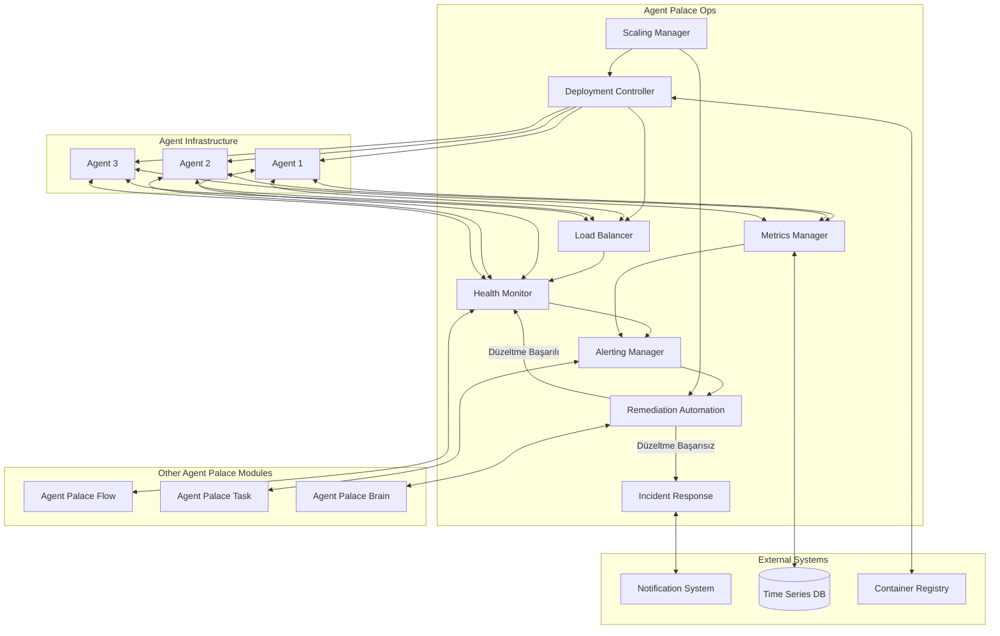

# Agent Palace Ops Detaylı Sayfa Spesifikasyonu

## Genel Bakış
- **Modülün Amacı:** Agent Palace Ops, yapay zeka ajanlarının operasyonel yönetimini, performans takibini ve sağlık izlemesini sağlayan kritik bir altyapı modülüdür. Bu modül sayesinde tüm ajan ekosisteminizin 7/24 kesintisiz ve verimli çalışmasını garanti altına alabilirsiniz.
- **Hedef Kitle:** DevOps uzmanları, sistem yöneticileri, SRE (Site Reliability Engineering) ekipleri, ve büyük ölçekli ajan operasyonlarını yöneten teknik ekipler.
- **Farklılaştırıcı Özellikler:** Proaktif izleme, otomatik hata giderme, kendi kendine iyileşme yeteneği, akıllı ölçekleme ve ayrıntılı performans metrik analizleri.
- **Slogan:** "Zero Downtime, Maximum Insight."

## Temel Özellikler
- **Proaktif Sağlık İzleme:** Ajanların ve bağlı sistemlerin sağlık durumunu sürekli ve gerçek zamanlı olarak izleyin, potansiyel sorunları gerçekleşmeden önce tespit edin.
- **Otomatik Hata Giderme:** Tanımlanmış hata şablonlarına göre sorunları otomatik olarak tespit ederek düzeltme prosedürlerini çalıştırın ve sistem bütünlüğünü koruyun.
- **Akıllı Ölçekleme:** İş yükü ve sistem kaynak kullanımına göre otomatik olarak ölçeklenen bir altyapı ile her zaman optimal performans sağlayın.
- **Kapsamlı Metrik ve Analiz:** Ajanlarınızın performansını, kaynak kullanımını ve etkileşimlerini detaylı olarak görselleştirin ve analiz edin.
- **Versiyonlama ve Rollback:** Sorun çıkması durumunda önceki kararlı versiyonlara otomatik olarak geri dönüş yaparak servis sürekliliğini sağlayın.

## Nasıl Çalışır



**Adım Adım İşleyiş:**

1. **Sürekli Sağlık İzleme:** Health Monitor, tüm ajanların ve bağlı sistemlerin sağlık durumunu düzenli aralıklarla kontrol eder.
2. **Metrik Toplama:** Metrics Manager, sistem performans metriklerini toplar ve analiz eder.
3. **Anormallik Tespiti:** Toplanan veriler analiz edilir ve anormal durumlar tespit edilir.
4. **Uyarı Tetikleme:** Alerting Manager, tespit edilen anormallikler için uyarılar oluşturur.
5. **Otomatik Çözüm:** Remediation Automation, tanımlanmış hata şablonlarına göre otomatik çözümler uygular.
6. **Olay Yönetimi:** Otomatik çözüm başarısız olursa Incident Response ekibi devreye girer.
7. **Ölçekleme:** Scaling Manager, iş yüküne göre sistem kaynaklarını otomatik olarak ölçekler.
8. **Dağıtım Kontrol:** Deployment Controller, yeni ajan versiyonlarının güvenli bir şekilde dağıtımını sağlar.

**Entegrasyon:**
Agent Palace Ops, diğer modüllerle tam entegrasyon içinde çalışır:
- **Flow Modülü:** Akışların sağlıklı çalıştığından emin olmak için
- **Task Modülü:** Görev yürütme performansını optimize etmek için
- **Brain Modülü:** Operasyonel verileri analiz etmek ve karar vermek için
- **Core Modülü:** Temel altyapı servisleriyle entegre olmak için

## Alt Modüller (Sub-modules)

### Health Monitor
- **Ana İşlevi:** Sistem ve ajan sağlık durumlarını sürekli olarak izler
- **Özellikler:**
  - Canlılık ve hazırlık kontrolleri
  - Otomatik sağlık taramaları
  - İzleme aralıklarının yapılandırılabilirliği
  - Sağlık durumu geçmişinin kaydedilmesi

### Metrics Manager
- **Ana İşlevi:** Sistem ve ajan performans metriklerini toplar ve analiz eder
- **Özellikler:**
  - Kapsamlı metrik toplama
  - Özelleştirilebilir dashboard'lar
  - Eğilim analizi
  - Anomali tespiti
  - Uzun vadeli metrik saklama

### Alerting Manager
- **Ana İşlevi:** Anormal durumlar için uyarılar oluşturur ve yönetir
- **Özellikler:**
  - Çoklu bildirim kanalları
  - Uyarı önceliklendirme
  - Uyarı gruplandırma
  - On-call rotasyonları
  - Eskalasyon politikaları

### Remediation Automation
- **Ana İşlevi:** Tespit edilen sorunlar için otomatik çözümler uygular
- **Özellikler:**
  - Sorun-çözüm şablon kütüphanesi
  - Otomatik düzeltme prosedürleri
  - Rollback yetenekleri
  - Çözüm etkinliği izleme

### Scaling Manager
- **Ana İşlevi:** Sistem kaynaklarını iş yüküne göre otomatik olarak ölçekler
- **Özellikler:**
  - Yatay ve dikey ölçekleme
  - Öngörücü ölçekleme
  - Kaynak optimizasyonu
  - Maliyet kontrolü

### Deployment Controller
- **Ana İşlevi:** Yeni ajan versiyonlarının güvenli dağıtımını kontrol eder
- **Özellikler:**
  - Aşamalı dağıtım (canary/blue-green)
  - Otomatik doğrulama
  - Acil rollback
  - Versiyon yönetimi

### Incident Response
- **Ana İşlevi:** Otomatik çözülemeyen sorunlar için müdahale süreçlerini yönetir
- **Özellikler:**
  - Olay kaydı ve takibi
  - Bildirim yönetimi
  - Runbook entegrasyonu
  - Post-mortem analizi

## Kullanım Senaryoları

### Senaryo 1: Proaktif Performans Optimizasyonu
**Zorluk:** Büyük bir e-ticaret şirketi, yoğun dönemlerde ajan sistemlerinin yavaşlaması ve hatta çökmesi sorunuyla karşı karşıya kalmaktadır.

**Çözüm:**
1. Agent Palace Ops'un Metrics Manager'ı, ajanların CPU, bellek ve ağ kullanımını sürekli olarak izler.
2. Öngörücü analitik algoritmaları, gelecekteki kaynak tüketimini tahmin eder.
3. Scaling Manager, tahminlere dayanarak yeni ajanları önceden hazırlar ve dağıtır.
4. Potansiyel darboğazları önceden tespit eden uyarılar oluşturulur ve otomatik iyileştirmeler devreye girer.

**Sonuç:** Sistem, en yoğun alışveriş günlerinde bile kesintisiz hizmet sunar ve müşteri deneyimi optimal seviyede kalır.

### Senaryo 2: Otomatik Hata Giderme
**Zorluk:** Bir finans kurumunun ajan tabanlı işlem onaylama sistemi, bazı durumlarda beklenmeyen hatalar vererek işlem akışını kesmektedir.

**Çözüm:**
1. Health Monitor, ajanların anormal davranışlarını tespit eder.
2. Alerting Manager, kritik bir uyarı oluşturur.
3. Remediation Automation, önceden tanımlanmış adımları uygular:
   - Sorunlu ajanı izole eder
   - Yedek ajanı devreye sokar
   - Sorunlu ajanı yeniden başlatır ve test eder
   - Düzeltme başarılı olursa ajanı tekrar devreye alır

**Sonuç:** Müşteriler hiçbir kesinti yaşamadan işlemlerine devam ederler, operasyon ekibi sadece özet bir rapor alır.

### Senaryo 3: Versiyon Yükseltme Güvenliği
**Zorluk:** Geniş bir ajan ağına sahip bir telekomünikasyon şirketi, yeni özellikleri hızlı bir şekilde ancak risk almadan dağıtmak istemektedir.

**Çözüm:**
1. Deployment Controller, yeni versiyonu önce küçük bir ajan grubu üzerinde test eder (canary deployment).
2. Metrics Manager, test grubunun performansını ve hata oranlarını yakından izler.
3. Başarılı sonuçlar alınırsa, dağıtım kademeli olarak genişletilir.
4. Herhangi bir sorun tespit edilirse, otomatik olarak önceki kararlı versiyona geri dönülür.

**Sonuç:** Yenilikler güvenli bir şekilde uygulanır, kullanıcılar sürekli olarak iyileştirilmiş hizmetlerden yararlanır.

## Teknik Özellikler

### Performans Metrikleri
- **Tepki Süresi:** 99.9%'dan fazla olayda 30 saniyeden kısa sürede müdahale
- **Kesinti Süresi:** Yıllık kesinti hedefi %0.01'den az (52 dakikadan az)
- **Ölçekleme Hızı:** 60 saniyeden kısa sürede yeni ajanlar devreye alınabilir
- **Metrik Gecikme Süresi:** 5 saniyeden az veri toplama gecikmesi

### Teknoloji Yığını
- **İzleme Altyapısı:** Prometheus, Grafana, OpenTelemetry
- **Veritabanı:** TimescaleDB, InfluxDB
- **Dağıtım:** Kubernetes, Helm, FluxCD
- **Bildirim:** PagerDuty, Slack, E-posta, SMS entegrasyonu
- **Otomasyon:** Ansible, Terraform, GitHub Actions

### Güvenlik Özellikleri
- **Erişim Kontrolü:** RBAC tabanlı yetkilendirme
- **Şifreleme:** Tüm iletişim kanallarında TLS/SSL
- **Denetim:** Tam kapsamlı audit logging
- **Yetki Yönetimi:** Principle of least privilege

### Entegrasyon API'leri
- RESTful API
- GraphQL endpoint
- Webhook desteği
- Streaming API (gerçek zamanlı veri)

## Demo ve Örnekler

### Canlı Dashboard
Örnek bir Ops Monitoring Dashboard'ı etkileşimli olarak görüntüleyin ve aşağıdaki göstergeleri inceleyin:
- Sistem sağlık durumu
- Ajan yük dağılımı
- Kaynak kullanımı
- Performans grafikleri
- Aktif uyarılar

### Otomasyon Demosu
Aşağıdaki senaryoların otomatik çözümünü gösteren demolar:
- Kilitlenmiş ajanın tespiti ve yeniden başlatılması
- Yüksek bellek kullanımı durumunda kaynak optimizasyonu
- Ağ bağlantı sorunları için otomatik yeniden yönlendirme

## SSS

**S: Agent Palace Ops'u mevcut monitoring altyapımızla entegre edebilir miyim?**
C: Evet, Prometheus, Grafana, ELK Stack, Datadog ve New Relic gibi popüler izleme çözümleriyle tam entegrasyon sağlıyoruz.

**S: Ops modülü ne kadar ölçeklenebilir?**
C: Modülümüz, birkaç ajandan binlerce ajana kadar sorunsuz ölçeklenir ve dağıtık mimarisi sayesinde her büyüklükteki operasyonu destekler.

**S: Özel metrikler tanımlayabilir miyim?**
C: Kesinlikle! Metrics Manager içerisinde özel metrikler tanımlayabilir, bunları izleyebilir ve bu metriklere dayalı uyarılar oluşturabilirsiniz.

**S: On-premise deployment destekleniyor mu?**
C: Evet, hem bulut tabanlı hem de şirket içi dağıtım seçenekleri sunuyoruz. Ayrıca hibrit modeli de desteklemekteyiz.

**S: Ops modülünün minimum sistem gereksinimleri nelerdir?**
C: Temel kurulum için 2 CPU, 4GB RAM ve 20GB depolama alanı yeterlidir. Ancak büyük ölçekli dağıtımlar için daha fazla kaynak önerilir.

## Başlangıç Kılavuzu

### Kurulum Adımları
1. Agent Palace Core modülünü kurun
2. Ops modülü eklentisini indirin
3. Yapılandırma dosyasını özelleştirin
4. İzleme hedeflerini tanımlayın
5. Uyarı kurallarını ayarlayın
6. Otomatik düzeltme şablonlarını yapılandırın
7. Dashboard'ları özelleştirin

### Hızlı Başlangıç
```bash
# Ops modülünü yükleyin
apt install agentspalace-ops

# Yapılandırma sihirbazını başlatın
ops-config-wizard

# İzleme servisini başlatın
systemctl start agentspalace-ops

# Durumu kontrol edin
ops-cli status
```

## Fiyatlandırma ve Planlar

### Temel Plan
- **Özellikler:** Temel izleme, manuel ölçekleme, sınırlı metrik saklama
- **Ajan Limiti:** 10
- **Fiyat:** Ücretsiz (Core paketi ile birlikte)

### Pro Plan
- **Özellikler:** Gelişmiş izleme, otomatik ölçekleme, 30 günlük metrik saklama
- **Ajan Limiti:** 50
- **Fiyat:** $299/ay

### Enterprise Plan
- **Özellikler:** Tam özellik seti, özelleştirilebilir ölçekleme politikaları, sınırsız metrik saklama
- **Ajan Limiti:** Sınırsız
- **Fiyat:** Özel fiyatlandırma

## Müşteri Hikayeleri

### XYZ Lojistik
*"Agent Palace Ops sayesinde, 500+ yapay zeka ajanımızın performansını tek bir dashboard üzerinden izliyor ve sorunlara anında müdahale edebiliyoruz. Önceden günler süren sorun tespitleri artık saniyeler içinde çözülüyor."* - Ali Yılmaz, Operasyon Direktörü

### ABC Finans
*"Kritik finansal işlemleri yürüten ajanlarımız için %99.999 uptime garantisi vermemiz gerekiyordu. Agent Palace Ops ile bu hedefi aşarak yıllık sadece 5 dakikalık planlanmış bakım dışında hiç kesinti yaşamadık."* - Ayşe Kaya, BT Müdürü

### DEF Perakende
*"Black Friday gibi yoğun dönemlerde sistemlerimiz eskiden çökerdi. Ops modülünün akıllı ölçekleme özelliği sayesinde, trafik artışını önceden algılayıp kapasitemizi otomatik olarak artırıyor ve sorunsuz bir alışveriş deneyimi sunabiliyoruz."* - Mehmet Can, E-ticaret Yöneticisi
