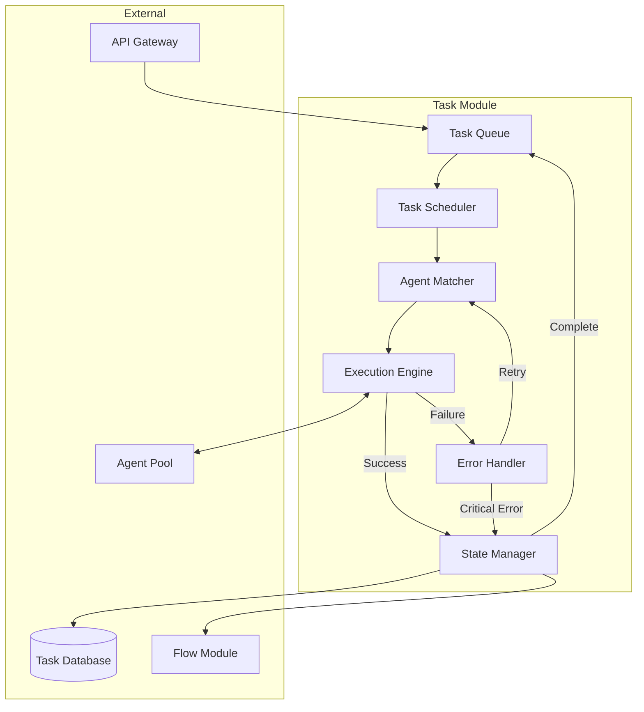

# Agent Palace Task

## Özet

Agent Palace Task modülü, platformun görev yönetimi ve agent orchestrasyonunu sağlayan temel bileşenidir. Bu modül, karmaşık görevleri yönetilebilir alt parçalara böler, doğru agent'lara atar ve tüm sürecin izlenmesini sağlar.

## Temel Özellikler

- **Görev Kuyruğu Yönetimi**: Öncelik, son tarih ve kaynak kısıtlamalarına göre sıralanmış akıllı görev kuyrukları
- **Agent Matchmaking**: Görevlerin en uygun agent'lara otomatik atanması
- **Paralel & Sıralı Çalıştırma**: Görevleri optimum şekilde paralel veya sıralı olarak yürütme
- **Retry Mekanizması**: Hata durumlarında akıllı yeniden deneme stratejileri
- **İlerleme Takibi**: Görevlerin gerçek zamanlı durum ve ilerleme bilgileri

## Nasıl Çalışır

Task modülü aşağıdaki bileşenlerden oluşur:

- **Task Scheduler**: Görevleri öncelik ve bağımlılıklara göre sıralar
- **Agent Matcher**: Görev gereksinimlerine göre en uygun agent'ı seçer
- **Execution Engine**: Görevlerin yürütülmesini ve sonuçların toplanmasını yönetir
- **State Manager**: Görev durumlarını takip eder ve raporlar
- **Error Handler**: Hata durumlarını yönetir ve iyileştirme stratejilerini uygular

### İş Akışı Diyagramı

## Kullanım Senaryoları

### Çoklu Kaynaklardan Veri Toplama

Farklı API'ler, veritabanları ve web sitelerinden veri toplama görevlerinin yönetimi.

### İş Akışı Otomasyonu

Şirket onay süreçleri, belge işleme ve raporlama gibi iş akışlarının otomatikleştirilmesi.

### Dağıtık Hesaplama

Büyük hesaplama görevlerinin paralel olarak çalışan agent'lar arasında dağıtılması.

### Müşteri Hizmetleri

Bilet açma, yanıtlama ve yönlendirme gibi müşteri hizmetleri görevlerinin otomatizasyonu.

## UI Mockupları

- Task Dashboard
- Görev Oluşturma Ekranı
- Agent Atama Paneli
- İlerleme İzleme Ekranı
- Hata Yönetim Konsolu

## Entegrasyon

### Diğer Modüllerle Entegrasyon

- **Flow Modülü**: İş akışlarından görev oluşturma ve tetikleme
- **Ops Modülü**: Görev performansı ve sağlık izleme
- **Brain Modülü**: Geçmiş görevlerden öğrenme ve optimizasyon
- **Map Modülü**: Konum tabanlı görev atama ve izleme

### Üçüncü Parti Entegrasyonları

- CI/CD sistemleri (Jenkins, GitHub Actions)
- İş takip sistemleri (Jira, Asana, Trello)
- İletişim platformları (Slack, MS Teams)
- CRM sistemleri (Salesforce, HubSpot)

## Teknik Özellikler

- **Ölçeklenebilirlik**: Yatay ölçeklenebilir mimari
- **Dayanıklılık**: İşlem durumunun kalıcı depolanması ve otomatik kurtarma
- **Gecikme**: Düşük gecikme süreli görev atama (<100ms)
- **Kapasite**: Milyon ölçeğinde eşzamanlı görev yönetimi
- **Güvenlik**: Görev yürütme izolasyonu ve yetkilendirme kontrolleri

## Sonuç

Agent Palace Task modülü, akıllı görev yönetimi ve agent orchestrasyonuyla karmaşık iş süreçlerini otomatikleştirir. Öncelikli görev sıralaması, akıllı agent eşleştirme ve robust hata yönetimi özellikleriyle, kurumların iş süreçlerini daha verimli ve güvenilir hale getirmelerine yardımcı olur.
